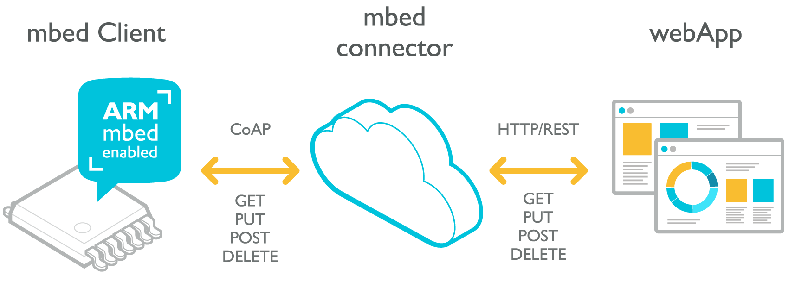
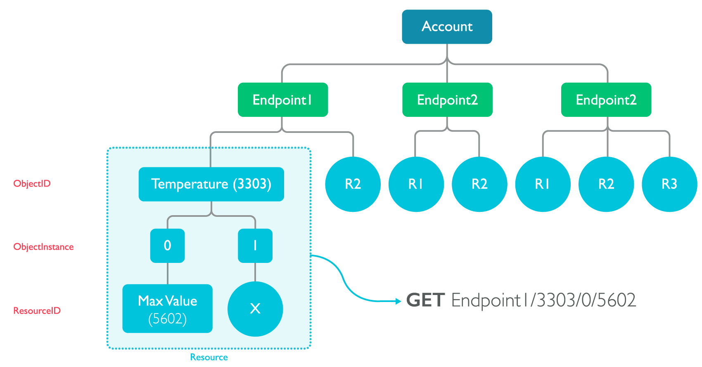

# mbed Device Connector Web API

The mbed Device Connector Web API is an HTTP REST API that lets you control your devices through mbed Device Connector. The API allows web apps to get and set data, trigger events, and subscribe to changes on the device, without needing to know about the protocol your device uses to connect.

This document is an introduction to the mbed Device Connector Web API. If you are familiar with the API you can jump straight to the [API Reference](api-reference.md).




Be aware that mbed Device Connector acts as an interface between your web application and the device. When the device is powered off, you cannot query the last known state. mbed Device Connector does not provide long term caching or historic data.

## Authentication

To connect your web app to the mbed Device Connector API you need an [access key](https://connector.mbed.com/#accesskeys). Every request sent to Connector uses your API key as part of the `Authorization` HTTP header, to validate the request to your mbed account and the devices that account controls.

```
Authorization: Bearer YOUR_ACCESS_KEY
```

If the Authorization header is not set, or if the access key is incorrect, requests return a `401 Unauthorized` status code.

## Asynchronous requests

Many functions in the mbed Device Connector API are asynchronous because it is not guaranteed
that an action (such as writing to a device) will happen straight away, as the device might be in deep sleep
or otherwise slow to respond. These functions are marked with '(async)' in the API reference:

* [Reading from a resource](api-reference.md#reading-from-a-resource-(async))
* [Executing a function on a resource](api-reference.md#executing-a-function-on-a-resource)
* [Writing to a resource](api-reference.md#writing-to-a-resource)
* [Deleting a resource](api-reference.md#deleting-a-resource)
* [Subscribing to an individual resource](api-reference.md#subscribing-to-an-individual-resource)

Requests to these APIs return a JSON object containing `async-response-id` in the following format:

```js
{"async-response-id":"1073741825#521f9d17-c5d7-4769-b89f-b608..."}
```

The actual response related to the `async-response-id` can be received by either [registering a notification  callback](#registering-a-notification-callback) or [long polling](#long polling). These mechanisms are explained in the following two chapters. The notification callback and long polling are also used for receiving [notifications](api-reference.md#notifications) about certain events, such as device registration or a change in its resource state.
In these cases, the `async-response-id` is not involved.


### Registering a notification callback

A notification callback, also called a *webhook*, is the primary mechanism for receiving a response for
an asynchronous request or for receiving event notifications.

When the response or event notification is available, mbed Device Connector notifies you by sending
a `PUT` request to a URL of your choice. This means that you will need a public-facing web server that can
receive the responses. If the URL of your web server is for example ``https://www.my-mbed-consumer.com/notify``,
you need to tell the API to send a notification to that URL:

    PUT /notification/callback
    Content-Type: application/json

    { "url": "https://www.my-mbed-consumer.com/notify" }

    HTTP/1.1 204 No Content


You can also specify which headers are sent with the `PUT` requests, for example to verify that a request actually came from mbed Device Connector. For more information, see [Registering a notification callback](api-reference.md#registering-a-notification-callback).

mbed Device Connector will make a PUT request to this URL immediately. If the URL you passed in is not reachable,
a `400 Bad Request` response is returned, with information on why the request failed in the response body.

If you did not register a URL where mbed Device Connector can notify you, calls to asynchronous APIs respond
with `412 Precondition Failed`, and the body says `No notification channel`.

<span style="background-color:#E6E6E6;  border:1px solid #000;display:block; height:100%; padding:10px">
**Note:** The callback registration stays valid forever except when your server cannot be reached for 7 days.
In this case, the callback registration is removed. Therefore, always re-register on application startup.
</span>

### Long polling

If it’s not possible to have a public facing callback URL, for example when developing on your
local machine, you can use [long polling](api-reference.md#long-polling) to check for new messages.
However, to reduce network traffic and to increase performance we recommend that you use callback URLs (webhooks) whenever possible.


## The mbed Device Connector data model

The mbed Device Connector data model consists of three levels. At the top there is your mbed account. Then there are endpoints, which are physical devices running [mbed Client](https://www.mbed.com/en/development/software/mbed-client/) and registered to an account. Each endpoint can have multiple resources it exposes. These resources may be readable and writable (like LEDs), or read only (like a serial number string). The endpoint controls which resources are exposed.

Resources are categorized using the [Lightweight Machine to Machine (LWM2M) protocol](http://technical.openmobilealliance.org/Technical/technical-information/omna/lightweight-m2m-lwm2m-object-registry) from the Open Mobile Alliance (OMA), which has three levels of structure:

*ObjectID/ObjectInstance/ResourceId*

* ObjectID: used to uniquely identify the thing being exposed, which is typically a grouping of other things under it. DeviceInformation (3), Temperature (3303), Humidity (3304) and Geolocation are all Object IDs.
* ObjectInstance: denotes which instance of the ObjectID you are talking about. There can be multiple temperature sensors on an endpoint, so the first would be /3303/0, and the second would be /3303/1, and so on.
* ResourceID: used to identify a unique resource on an object. The Resource ID is also where the values are held. Things like Max Measured Value (5602), Min Measured Value (5601), and Sensor Value (5700) are all examples of resource IDs.




Using the LWM2M specification it’s easy for services and machines to discover resources and have a standard way of controlling them. The specification is essentially a giant look-up table. The [full OMA LWM2M specification can be found here](http://technical.openmobilealliance.org/Technical/technical-information/omna/lightweight-m2m-lwm2m-object-registry).

### Example

If you want to read the sensor value (resource ID 5700) from a temperature object (3303) on endpoint1 you need to ``GET /endpoints/endpoint1/3303/0/5700``.

Likewise, to discover what endpoints are on a domain you can ``GET /endpoints``, and to discover what resources are on endpoint1 you can ``GET /endpoints/endpoint1``.

### Defining resources in mbed Client

Resources are defined by the endpoint, which runs mbed Client. As a reference:

* The endpoint name is set in [M2MInterfaceFactory::create_interface](https://docs.mbed.com/docs/mbed-client-guide/en/latest/api/classM2MInterfaceFactory.html#a59d3697e394c02ecebb4c51f7c07de51).
* Resources are created via:
    * [M2MInterfaceFactory::create_object](https://docs.mbed.com/docs/mbed-client-guide/en/latest/api/classM2MInterfaceFactory.html#a173c443bb6cc427c52203ed8183c5361) (ObjectId)
    * [M2MObjectInstance::create_dynamic_resource](https://docs.mbed.com/docs/mbed-client-guide/en/latest/api/classM2MObjectInstance.html#a9b3f88dc2d28512ea6c3db6f74168c3f) and [M2MObjectInstance::create_static_resource](https://docs.mbed.com/docs/mbed-client-guide/en/latest/api/classM2MObjectInstance.html#aaa596f731688730d7a883b7f1251a662) (ResourceId)

You can find full documentation in the [mbed Client documentation](https://docs.mbed.com/docs/mbed-client-guide/en/latest/Introduction/).

## Example applications

We have example web applications available for [Java](https://github.com/ARMmbed/mbed-webapp-example/), Node.js and Python.

